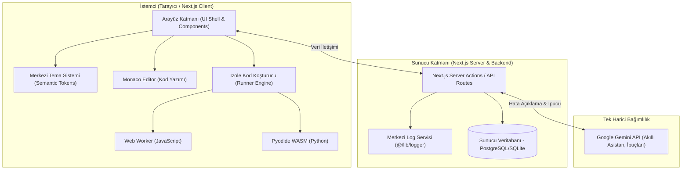

# TryFinally — Sistem Mimarisi ve Tasarım Desenleri (System Patterns)

Bu belge, **TryFinally** projesinin sistem mimarisini, katmanlar arası ilişkileri, Clean Architecture prensiplerini, ultra-modüler tema sistemini ve kodlama kurallarını tanımlar.

---

## 1. Genel Mimari Şeması



---

## 2. Clean Architecture & Modül Sözleşmesi (`features/*`)

Her özellik (feature) kendi kendine yeten, bağımsız ve modüler bir klasör olarak tasarlanır:

```text
src/features/<ozellik-adi>/
├── types.ts      # Domain modelleri, arayüzler ve tip tanımları
├── service.ts    # İş mantığı, veri iletişimi ve servis fonksiyonları
├── ui.tsx        # Görsel arayüz bileşenleri (Presenter)
└── index.ts      # Dışa aktarılan genel API kapısı (Public Contract)
```

### Katı Modül İletişim Kuralı:
* **Asla Derin İçe Aktarma Yapılamaz:** Bir modül başka bir modülün iç dosyasına (`features/puzzles/service.ts`) doğrudan erişemez.
* **Sadece `index.ts` Üzerinden Erişim:** Dışa açılacak her bileşen ve fonksiyon ilgili modülün `index.ts` dosyasından dışa aktarılır.
  ```typescript
  // DOĞRU:
  import { PuzzleCard, getPuzzleById } from "@/features/puzzles";

  // YANLIŞ:
  import { PuzzleCard } from "@/features/puzzles/ui";
  import { getPuzzleById } from "@/features/puzzles/service";
  ```

---

## 3. Ultra-Modüler Taslak Tema Mimarisi

Sistemin gelecekte tek bir dokunuşla yeni bir temaya bürünebilmesi için **Semantik Renk Token'ları** kullanılır:

### Taslak Token Sözleşmesi:
* `background`: Sayfanın temel arka planı.
* `surface`: Kartların, panellerin ve diyalogların arka planı.
* `primary`: Ana marka rengi, birincil butonlar ve önemli vurgular.
* `secondary`: İkincil eylemler ve destekleyici alanlar.
* `accent`: Rozetler, dikkat çekici etiketler ve özel durumlar.
* `muted`: Pasif metinler, devre dışı elemanlar ve hafif arka planlar.
* `border`: Kenarlıklar ve ayırıcı çizgiler.
* `destructive`: Hata mesajları, silme butonları ve tehlikeli işlemler.

### Tema Değiştirme Kuralı:
Bileşenlerde asla `text-blue-500` veya `#3b82f6` gibi statik renkler yazılmaz. Her zaman semantik sınıflar kullanılır:
```tsx
// DOĞRU:
<div className="bg-surface text-foreground border border-border">
  <button className="bg-primary text-primary-foreground">Çalıştır</button>
</div>

// YANLIŞ (Gelecekte tema değişimini imkansız kılar):
<div className="bg-[#1e1e2e] text-white border border-gray-700">
  <button className="bg-blue-600 text-white">Çalıştır</button>
</div>
```
* **Kullanıcı nihai tema paletini verdiğinde:** Sadece `src/lib/theme/tokens.ts` (veya `globals.css`) içindeki token renk değerleri güncellenir ve A'dan Z'ye tüm platform anında yeni temaya geçer.

---

## 4. İstemci Tarafı Güvenli Kod Koşturucu Mimarisi (Runner Engine)

Sunucu kaynaklarını korumak ve sonsuz döngü (infinite loop) veya kötü amaçlı kodlara karşı güvenliği sağlamak için:
1. **JavaScript Web Worker:**
   - Kod, ana tarayıcı thread'inden ayrı bir Web Worker içinde çalıştırılır.
   - 3 saniyelik zaman aşımı (timeout) uygulanır; süre aşılırsa worker anında sonlandırılır (terminate).
   - `console.log` çıktıları yakalanarak kullanıcı ekranındaki konsola yönlendirilir.
2. **Python Pyodide (WASM):**
   - Tarayıcıda WebAssembly üzerinde çalışan Pyodide kullanılır.
   - Standart kütüphaneler yerel olarak çalıştırılır, girdi-çıktı akışları yakalanır.

---

## 5. Google Gemini API Entegrasyon Deseni (`features/ai`)

* Tek harici API bağımlılığıdır.
* API anahtarı `GEMINI_API_KEY` sunucu tarafında saklanır; istemciye asla sızdırılmaz.
* İstekler Next.js Server Action veya API route üzerinden kontrollü bir biçimde iletilir.
* Prompt'lar "Pedagojik ve Teşvik Edici" formatta hazırlanır (kullanıcıya cevabı direkt vermek yerine hatanın mantığını açıklar).
